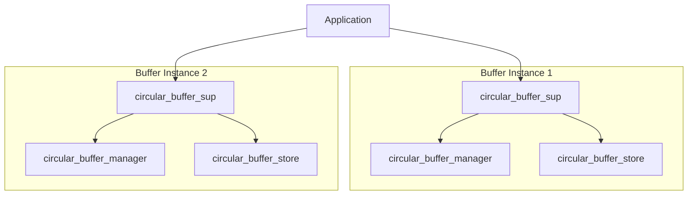

# Erlang Circular Buffer Implementation

A fault-tolerant circular buffer implementation using Erlang/OTP supervision trees and gen_server behaviors.



## Features
- Thread-safe concurrent access
- Configurable overflow policies (overwrite/reject)
- Supervision tree for fault tolerance
- Capacity tracking and space checks
- Clean OTP-compliant architecture

## Installation
1. Clone the repository
2. Ensure Erlang/OTP 26+ is installed
3. Build with Rebar3:
```bash
rebar3 compile
```

## Usage

### Starting the Shell
```bash
rebar3 shell --name "buffer@127.0.0.1" --setcookie mycookie
```

### Basic Operations
```erlang
% Create buffer with size 5
{ok, Sup1} = circular_buffer_sup:start_link(5),
Manager1 = circular_buffer:children(Sup1).

% Write items
circular_buffer:write(Manager1, item1),
circular_buffer:write_attempt(Manager1, item2).

% Read items
{ok, Item} = circular_buffer:read(Manager1). % Returns item1
```

### Two Buffers in Action
```erlang
% Create two independent buffers
{ok, Sup1} = circular_buffer_sup:start_link(3),
{ok, Sup2} = circular_buffer_sup:start_link(5),

Manager1 = circular_buffer:children(Sup1),
Manager2 = circular_buffer:children(Sup2),

% Buffer 1 operations
circular_buffer:write(Manager1, a),
circular_buffer:write(Manager1, b),

% Buffer 2 operations
circular_buffer:write(Manager2, x),
circular_buffer:write(Manager2, y),
circular_buffer:write(Manager2, z),

% Read from both
{ok, A} = circular_buffer:read(Manager1), % a
{ok, X} = circular_buffer:read(Manager2). % x
```

## API Reference

### circular_buffer Module
| Function | Description |
|----------|-------------|
| `create(Size)` | Creates new buffer instance |
| `size(Pid)` | Returns buffer capacity |
| `write(Pid, Item)` | Write with overwrite policy |
| `write_attempt(Pid, Item)` | Write without overwriting |
| `read(Pid)` | Read oldest item |
| `children(SupPid)` | Get manager PID from supervisor |

## Architecture

```
+----------------+
| Application    |
+----------------+
       |
       v
+----------------+       +---------------------+
| Supervisor     |------>| Manager (gen_server)|
| (per buffer)   |       +---------------------+
+----------------+               |
       |                         v
       |                +---------------------+
       +--------------->| Store (gen_server)  |
                        +---------------------+
```

- **Supervisor**: Manages process lifecycle
- **Manager**: Handles client API and policies
- **Store**: Manages raw buffer operations

## Fault Tolerance Features
- Automatic restarts of failed processes
- Isolated failures between buffer instances
- Configurable restart strategies
- Process monitoring between components

## Contributing
1. Fork the repository
2. Add tests in `test/circular_buffer_tests.erl`
3. Submit PR with:
```bash
rebar3 ct
rebar3 dialyzer
```